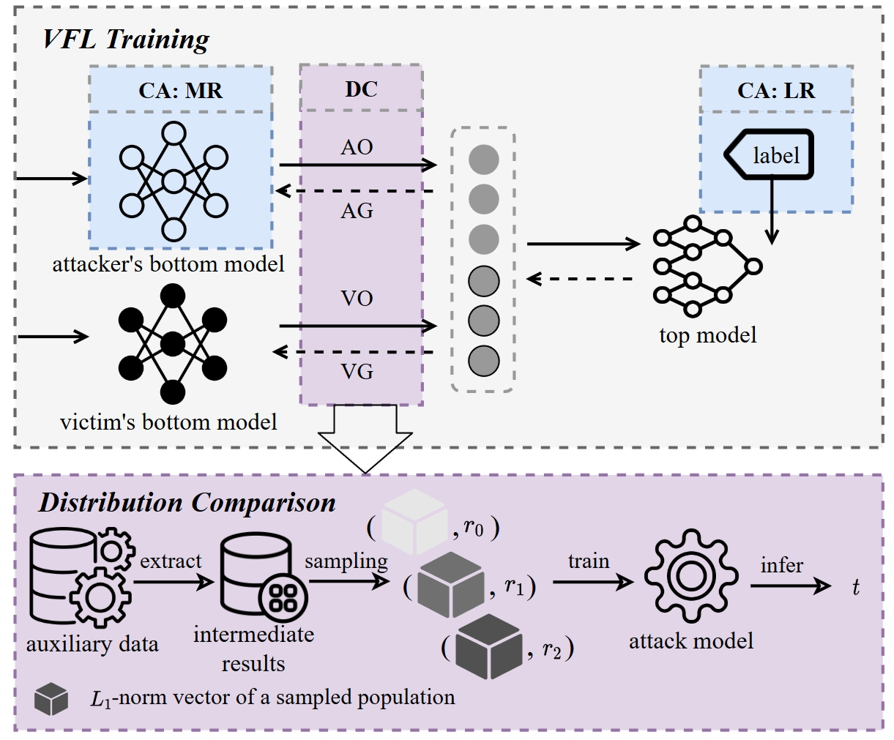
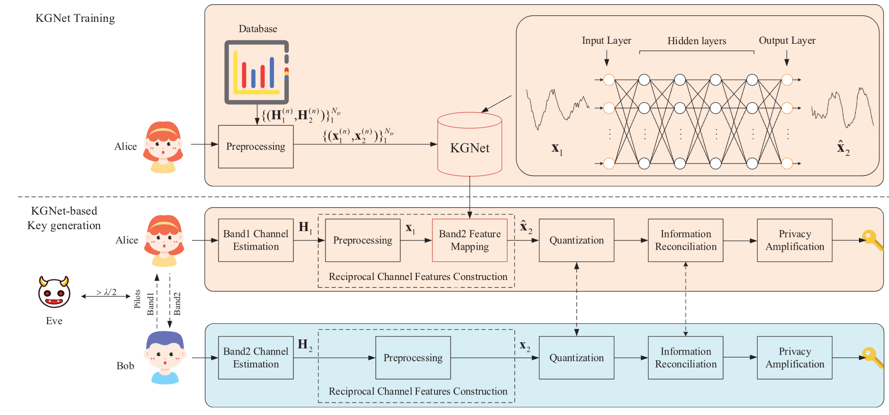

# Publications 
([⋅]* is the corresponding author)

IEEE TIFS 2025

- [**ProVFL: Property Inference Attacks against Vertical Federated Learning**](https://ieeexplore.ieee.org/document/11045555)  
Li Bai, **Xinwei Zhang**, Sen Zhang, Qingqing Ye, Haibo Hu*  
_IEEE Transactions on Information Forensics and Security (TIFS)_, vol. 20, pp. 6529-6543, 2025. 
[[Code](https://github.com/BaiLibl/ProVFL)] [<a href="https://xinweizhang1998.github.io/_pages/File/TIFS25_ProVFL.pdf" target="_blank">PDF</a>]

ACM WWW 2025

- [**MER-Inspector: Assessing Model Extraction Risks from An Attack-Agnostic Perspective**](https://dl.acm.org/doi/abs/10.1145/3696410.3714894)   
**Xinwei Zhang**, Haibo Hu*, Qingqing Ye, Li Bai, Huadi Zheng  
_In Proc. The ACM Web Conference (WWW)_, 2025. (Acceptance rate=19.8%)  
[[Code](https://github.com/XinweiZhang1998/MER_Inspector)]  [<a href="https://xinweizhang1998.github.io/_pages/File/WWW25_MER_Inspector.pdf" target="_blank">PDF</a>]

IEEE TVT 2024

- [**Enabling Deep Learning-based Physical-layer Secret Key Generation for FDD-OFDM Systems in Multi-Environments**](https://ieeexplore.ieee.org/document/10440494)   
**Xinwei Zhang**, Guyue Li*, Junqing Zhang, Linning Peng, Aiqun Hu, Xianbin Wang  
_IEEE Transactions on Vehicular Technology (TVT)_, vol. 73, no. 7, pp. 10135-10149, July 2024.

IEEE IoT-J 2022

- [**Deep Learning-based Physical-Layer Secret Key Generation for FDD Systems**](https://ieeexplore.ieee.org/document/9526766)   
**Xinwei Zhang**, Guyue Li*, Junqing Zhang, Aiqun Hu, Zongyue Hou, Bin Xiao  
_IEEE Internet of Things Journal (IoT-J)_, vol. 9, no. 8, pp. 6081-6094, April 2022.  
[[code](https://github.com/XinweiZhang1998/Code-of-KGNet)]

- [**A Secure and Reliable Blockchain-based Audit Log System**](https://ieeexplore.ieee.org/document/10623012)   
Zhonghao Liu, **Xinwei Zhang**, Guyue Li, Helei Cui, Jiaheng Wang, Bin Xiao*  
_In Proc. IEEE International Conference on Communications (ICC)_, 2024.

- [**DBE-voting: A Privacy-preserving and Auditable Blockchain-based E-voting System**](https://ieeexplore.ieee.org/document/10279692)   
Zhonghao Liu, **Xinwei Zhang**, Laphou Lao, Guyue Li, Bin Xiao*  
_In Proc. IEEE International Conference on Communications (ICC)_, 2023.

- [**Secret Key Generation for FDD Systems Based on Complex-Valued Neural Network**](https://ieeexplore.ieee.org/document/9625252)   
**Xinwei Zhang**, Guyue Li*, Zongyue Hou and Aiqun Hu  
_In Proc. 2021 IEEE 94th Vehicular Technology Conference (VTC)_, 2021.
  
- [**Secret Key Generation Scheme Based on Generative Adversarial Networks in FDD Systems**](https://ieeexplore.ieee.org/document/9484457)   
 Zongyue Hou and **Xinwei Zhang***  
_In Proc. IEEE Conference on Computer Communications Workshops (INFOCOM WKSHPS)_, 2021. 

# Other Publications
- [Patent] 李古月；**张鑫伟**；侯宗越；王星宇，一种基于深度学习的频分双工系统密钥生成方法，已授权，2022/11/18，CN112906035B.
