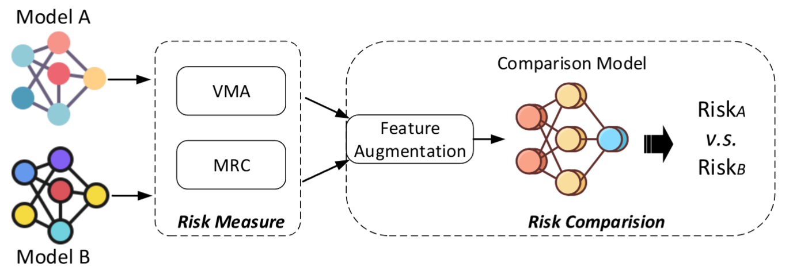
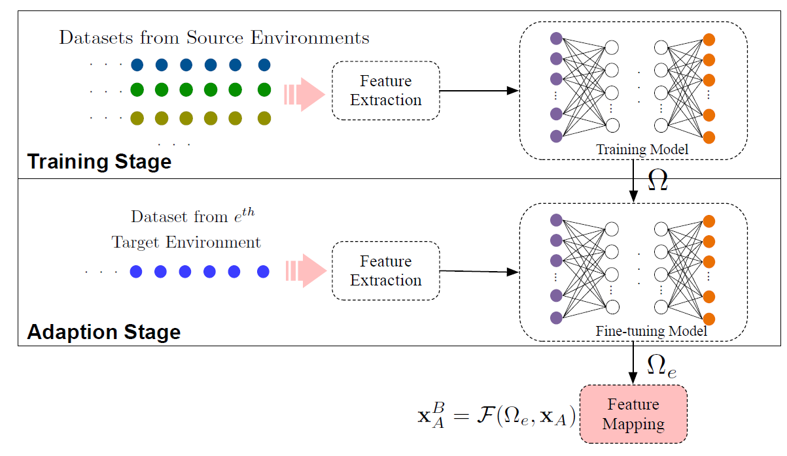

# Publications 
([⋅]* is the corresponding author)

WWW2025

[MER-Inspector: Assessing Model Extraction Risks from An Attack-Agnostic Perspective](https://openreview.net/forum?id=PrmAeIReL1#discussion)  
**X. Zhang**, H. Hu*, Q. Ye, L. Bai, H. Zheng  
_In Proc. The ACM Web Conference (WWW)_, 2025. (Acceptance rate=19.8%)  
[[Code](https://github.com/XinweiZhang1998/MER_Inspector)]  [<a href="../File/WWW25_MER_Inspector.pdf" target="_blank">PDF.</a>]

TVT2024

  [Enabling Deep Learning-based Physical-layer Secret Key Generation for FDD-OFDM Systems in Multi-Environments](https://ieeexplore.ieee.org/document/10440494)   
**X. Zhang**, G. Li*, J. Zhang, L. Peng, A. Hu, X. Wang  
_IEEE Transactions on Vehicular Technology (TVT)_, vol. 73, no. 7, pp. 10135-10149, July 2024.

- [A Secure and Reliable Blockchain-based Audit Log System](https://ieeexplore.ieee.org/document/10623012)   
Z. Liu, **X. Zhang**, G. Li, H. Cui, J. Wang, B. Xiao*  
_In Proc. IEEE International Conference on Communications (ICC)_, 2024.

- [DBE-voting: A Privacy-preserving and Auditable Blockchain-based E-voting System](https://ieeexplore.ieee.org/document/10279692)   
Z. Liu, **X. Zhang**, L. Lao, G. Li, B. Xiao*  
_In Proc. IEEE International Conference on Communications (ICC)_, 2023.

- [Deep Learning-based Physical-Layer Secret Key Generation for FDD Systems](https://ieeexplore.ieee.org/document/9526766)   
**X. Zhang**, G. Li*, J. Zhang, A. Hu, Z. Hou, B. Xiao  
_IEEE Internet of Things Journal (IoT-J)_, vol. 9, no. 8, pp. 6081-6094, April 2022. [[code](https://github.com/XinweiZhang1998/Code-of-KGNet)]

- [Secret Key Generation for FDD Systems Based on Complex-Valued Neural Network](https://ieeexplore.ieee.org/document/9625252)   
**X. Zhang**, G. Li*, Z. Hou and A. Hu  
_In Proc. 2021 IEEE 94th Vehicular Technology Conference (VTC)_, 2021.
  
- [Secret Key Generation Scheme Based on Generative Adversarial Networks in FDD Systems](https://ieeexplore.ieee.org/document/9484457)   
 Z. Hou and **X. Zhang***  
_In Proc. IEEE Conference on Computer Communications Workshops (INFOCOM WKSHPS)_, 2021. 

# Other Publications
- [Patent] 李古月；**张鑫伟**；侯宗越；王星宇，一种基于深度学习的频分双工系统密钥生成方法，已授权，2022/11/18，CN112906035B.
